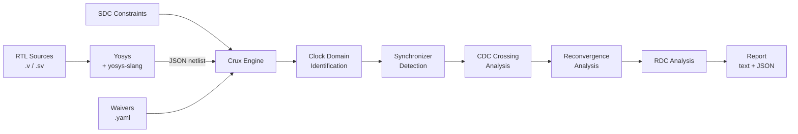

# Crux — Clock & Reset Unsafe X-ing

Open-source CDC (Clock Domain Crossing) and RDC (Reset Domain Crossing) static analysis engine built on [Yosys](https://github.com/YosysHQ/yosys).

No open-source CDC/RDC tool exists in the EDA ecosystem. The only alternatives are commercial tools costing six figures annually (Synopsys SpyGlass CDC, Siemens Questa CDC, Cadence Meridian CDC). Crux fills this gap.

## What it does

```
Verilog/SystemVerilog → Yosys (flatten + explicit FFs) → Crux analysis → CDC/RDC report
```



### Violation types

| Rule | Severity | Description |
|------|----------|-------------|
| `MISSING_SYNC` | error | Signal crosses clock domain without synchronizer |
| `COMBO_BEFORE_SYNC` | error | Combinational logic on CDC path before sync stage |
| `MULTI_BIT_CDC` | error | Multi-bit bus crossing without gray code or handshake |
| `RECONVERGENCE` | warn/info | Independently synchronized paths reconverge downstream |
| `RESET_DOMAIN_CROSSING` | error | Async reset from different domain without reset synchronizer |
| `CLOCK_GLITCH` | error | Combinational logic driving a clock input |

### Synchronizer recognition

- N-FF chains (2FF, 3FF) — structural pattern matching
- Known modules — `prim_flop_2sync`, `prim_pulse_sync`, `prim_fifo_async`, `prim_sync_reqack`, PULP CDC cells
- Reset sync — "async assert, sync de-assert" pattern (prim_rst_sync)

## Install

```bash
pip install -e .
```

Requires Yosys >= 0.40 (`dnf install yosys` / `apt install yosys`).
For SystemVerilog, build the yosys-slang plugin: `make yosys-slang` (needs `yosys-devel cmake ninja-build`).

## Usage

### Catch a missing synchronizer

```
$ crux --top simple_cdc tests/designs/simple_cdc.v

============================================================
  Crux CDC/RDC Analysis Report
============================================================

  Design:   simple_cdc
  Version:  crux 0.1.0

Clock Domains:
----------------------------------------
  clk_a                   1 FFs  (posedge)
  clk_b                   1 FFs  (posedge)

Domain Crossings:
------------------------------------------------------------
  clk_a -> clk_b: 1 signal(s), 0 synchronized, 1 VIOLATION(S)

Violations:
------------------------------------------------------------
  1. [ERROR] [MISSING_SYNC] Missing synchronizer: 'data_a' (clk_a -> clk_b), source: $procdff$14, dest: $procdff$9
     Signal: data_a
     Path:   clk_a -> clk_b

============================================================
  Total crossings:  1
  Synchronized:     0
  Errors:           1
  Warnings:         0
============================================================
```

### Multi-domain SoC with SDC constraints

A 3-clock design with pulse sync, missing sync, and multi-bit CDC bugs:

```
$ crux --top realistic_soc --sdc tests/constraints/realistic_soc.sdc tests/designs/realistic_soc.v

Clock Domains:
----------------------------------------
  aon_clk                 4 FFs  (posedge)
  io_clk                  4 FFs  (posedge)
  sys_clk                 3 FFs  (posedge)

Domain Crossings:
------------------------------------------------------------
  sys_clk -> aon_clk: 1 signal(s), 0 synchronized, 1 VIOLATION(S)
  sys_clk -> io_clk: 2 signal(s), 1 synchronized, 1 VIOLATION(S)

Violations:
------------------------------------------------------------
  1. [ERROR] [MULTI_BIT_CDC] Multi-bit CDC without encoding: 'sys_status' (sys_clk -> io_clk),
     8 bits crossing without gray code or handshake
  2. [ERROR] [MISSING_SYNC] Missing synchronizer: 'sys_status' (sys_clk -> aon_clk)

Synchronized Crossings:
------------------------------------------------------------
  u_uart_pulse_sync.u_sync.d_i: sys_clk -> io_clk [nff_chain, 2-stage]
```

The pulse synchronizer (`prim_pulse_sync` → toggle + 2FF + edge detect) is correctly recognized. The two real bugs are flagged.

### Analyze real OpenTitan hardware

```
$ crux --top prim_fifo_async -I extern/opentitan/hw/ip/prim/rtl -DSYNTHESIS \
    extern/opentitan/hw/ip/prim_generic/rtl/prim_flop.sv \
    extern/opentitan/hw/ip/prim_generic/rtl/prim_flop_2sync.sv \
    extern/opentitan/hw/ip/prim/rtl/prim_fifo_async.sv

Clock Domains:
----------------------------------------
  clk_rd_i                4 FFs  (posedge)
  clk_wr_i                5 FFs  (posedge)

Domain Crossings:
------------------------------------------------------------
  clk_rd_i -> clk_wr_i: 1 signal(s), 1 synchronized, OK
  clk_wr_i -> clk_rd_i: 1 signal(s), 1 synchronized, OK

Violations:
------------------------------------------------------------
  None.
Synchronized Crossings:
------------------------------------------------------------
  fifo_rptr_gray_q: clk_rd_i -> clk_wr_i [nff_chain, 2-stage]
  fifo_wptr_gray_q: clk_wr_i -> clk_rd_i [nff_chain, 2-stage]
```

Zero false positives on OpenTitan's production async FIFO with gray-coded pointers.

### CLI reference

```
crux [OPTIONS] VERILOG_FILES...

Options:
  --top TEXT              Top-level module name (required)
  --sdc PATH             SDC constraints file
  --waiver PATH          YAML waiver file
  --json-report PATH     Write JSON report
  --sv                   Use yosys-slang for SystemVerilog
  -I PATH                Include directory (repeatable)
  -D TEXT                Preprocessor define (repeatable)
  --max-recon-depth INT  Reconvergence trace depth (default: 2)
  --no-rdc               Skip RDC analysis
  -q / --quiet           Minimal output
  -v / --verbose         Show Yosys output
  --version              Show version
```

## Validated against real hardware

Tested on OpenTitan CDC primitives with **zero false positives**:

| Module | Pattern | Crossings | FP |
|--------|---------|-----------|-----|
| `prim_pulse_sync` | toggle + 2FF + edge detect | 1 | 0 |
| `prim_fifo_async` | gray-coded pointer sync | 2 | 0 |
| `prim_sync_reqack` | REQ/ACK handshake | 2 | 0 |

```bash
make opentitan-setup      # sparse-checkout OpenTitan IPs
make validate-opentitan   # run crux on all three
```

## SDC constraints

Crux uses a real TCL interpreter (not regex) to parse SDC files:

```tcl
create_clock -name clk_main -period 10.0 [get_ports clk_i]
create_clock -name clk_usb  -period 20.83 [get_ports clk_usb_i]
create_generated_clock -name clk_div2 -source [get_ports clk_i] -divide_by 2 [get_pins div/out]
set_clock_groups -asynchronous -group {clk_main} -group {clk_usb}
```

## Waivers

Suppress known-safe violations with YAML waivers:

```yaml
waivers:
  - rule: MULTI_BIT_CDC
    signal: "status_*"
    from_domain: "sys_clk"
    reason: "quasi-static, read only during idle"
```

## Project structure

```
src/crux/
├── cli.py              # CLI entry point
├── yosys_runner.py     # Yosys invocation + JSON export
├── netlist.py          # Yosys JSON → internal FF/net model
├── clock_domains.py    # Group FFs by clock
├── trace.py            # Backward cone tracing
├── synchronizers.py    # N-FF chain + known module detection
├── reconvergence.py    # Forward BFS from sync outputs
├── rdc.py              # Reset domain crossing + clock glitch
├── sdc_parser.py       # SDC via TCL interpreter
├── waivers.py          # YAML waiver matching
├── cdc_check.py        # Analysis orchestrator
└── report.py           # Text + JSON reports
```

## Status

Steps 1–3 of 4 complete.

- [x] Core CDC detection (missing sync, combo-before-sync, multi-bit)
- [x] SDC constraint parsing (real TCL, not regex)
- [x] Synchronizer pattern library (N-FF, pulse sync, FIFO, handshake, known modules)
- [x] Reconvergence analysis (forward BFS, mux-aware)
- [x] RDC analysis (async reset crossing, reset sync pattern recognition)
- [x] Clock glitch detection
- [x] YAML waiver system
- [x] SystemVerilog via yosys-slang
- [ ] Accellera CDC/RDC Standard 1.0 constraint format
- [ ] Large design scaling (OpenTitan full SoC)
- [ ] CI integration (GitHub Actions CDC checks)

## License

Apache 2.0
