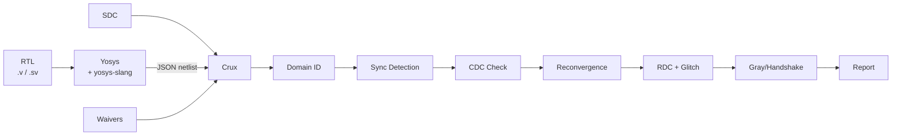

# Crux — Clock & Reset Unsafe X-ing

Open-source CDC (Clock Domain Crossing) and RDC (Reset Domain Crossing) static analysis engine built on [Yosys](https://github.com/YosysHQ/yosys).

No production-quality open-source CDC/RDC tool exists. The closest prior art is `cdc_snitch` (~282 lines). Crux is a structural analysis tool — it does not do formal verification or simulation-based CDC checking.




## What it detects

| Rule | Severity | What |
|------|----------|------|
| `MISSING_SYNC` | error | Signal crosses domain without synchronizer |
| `COMBO_BEFORE_SYNC` | error | Combo logic on CDC path before sync FF |
| `MULTI_BIT_CDC` | error/warn | Multi-bit crossing: error if unprotected, warning if handshake-gated |
| `RECONVERGENCE` | warn/info | Independently synced paths reconverge (info if through MUX) |
| `RESET_DOMAIN_CROSSING` | error | Async reset from different domain without sync |
| `CLOCK_GLITCH` | error | Combo logic driving clock (recognizes glitch-free mux pattern) |
| `FREQ_MISMATCH` | warning | Related clocks with non-integer frequency ratio |

## What it recognizes as safe

- N-FF synchronizer chains (2FF, 3FF) via structural fan-out analysis
- Known CDC modules (`prim_flop_2sync`, `prim_pulse_sync`, `prim_fifo_async`, `prim_sync_reqack`, PULP cells) via flattened hierarchy name matching
- Gray-coded buses: verifies XOR-shift pattern (`gray = bin ^ (bin >> 1)`) in Yosys netlist
- Handshake-protected multi-bit crossings: traces `$adffe` enable to synchronized control signal
- Reset sync stages: "async assert, sync de-assert" pattern (Q drives same-domain FF ARST)
- Glitch-free clock mux: AND-OR tree with negedge-clocked select FFs

## What it does NOT do

- Formal verification of CDC protocols
- Metastability MTBF calculation (needs technology library data)
- Simulation-based CDC checking
- Hierarchical analysis (requires flattened design)
- Full Accellera CDC/RDC Standard 1.0 support (planned)

## Install

```bash
pip install -e .
```

Requires Yosys >= 0.40 (`dnf install yosys` / `apt install yosys`).
For SystemVerilog: `make yosys-slang` (needs `yosys-devel cmake ninja-build`).

## Usage

### Missing synchronizer

```
$ crux --top simple_cdc tests/designs/simple_cdc.v

Clock Domains:
  clk_a                   1 FFs  (posedge)
  clk_b                   1 FFs  (posedge)

Domain Crossings:
  clk_a -> clk_b: 1 signal(s), 0 synchronized, 1 VIOLATION(S)

Violations:
  1. [ERROR] [MISSING_SYNC] Missing synchronizer: 'data_a' (clk_a -> clk_b)
```

### 3-domain SoC with handshake + real bug

```
$ crux --top soc_subsystem --sdc tests/constraints/engineer_scenario.sdc tests/designs/engineer_scenario.v

Clock Domains:
  clk_dma                 5 FFs  (posedge)
  clk_per                 5 FFs  (posedge)
  clk_sys                 7 FFs  (posedge)

Domain Crossings:
  clk_dma -> clk_sys: 1 signal(s), 1 synchronized, OK
  clk_per -> clk_dma: 1 signal(s), 0 synchronized, 1 VIOLATION(S)
  clk_per -> clk_sys: 1 signal(s), 1 synchronized, OK
  clk_sys -> clk_dma: 2 signal(s), 1 synchronized, 1 VIOLATION(S)
  clk_sys -> clk_per: 1 signal(s), 1 synchronized, OK

Violations:
  1. [WARN ] [MULTI_BIT_CDC] Multi-bit CDC with handshake qualifier:
     'dma_data' (clk_sys -> clk_dma), 8 bits, enable gated by synchronized control
  2. [ERROR] [MULTI_BIT_CDC] Multi-bit CDC without encoding:
     'spi_cmd_per' (clk_per -> clk_dma), 4 bits without gray code or handshake

Synchronized Crossings:
  uart_ack: clk_per -> clk_sys [nff_chain, 2-stage]
  uart_pending: clk_sys -> clk_per [nff_chain, 2-stage]
  dma_ack: clk_dma -> clk_sys [nff_chain, 2-stage]
  dma_req: clk_sys -> clk_dma [nff_chain, 2-stage]
```

The handshake-protected DMA data is downgraded to warning (enable traces to synced req). The unprotected SPI command is flagged as error.

### OpenTitan async FIFO

```
$ crux --top prim_fifo_async -I extern/opentitan/hw/ip/prim/rtl -DSYNTHESIS \
    extern/opentitan/hw/ip/prim_generic/rtl/prim_flop.sv \
    extern/opentitan/hw/ip/prim_generic/rtl/prim_flop_2sync.sv \
    extern/opentitan/hw/ip/prim/rtl/prim_fifo_async.sv

Synchronized Crossings:
  fifo_rptr_gray_q: clk_rd_i -> clk_wr_i [nff_chain, 2-stage]
  fifo_wptr_gray_q: clk_wr_i -> clk_rd_i [nff_chain, 2-stage]

Violations: None.
```

### CLI

```
crux [OPTIONS] VERILOG_FILES...

  --top TEXT              Top module (required)
  --sdc PATH             SDC constraints
  --waiver PATH          YAML waiver file
  --json-report PATH     JSON output
  --sv                   SystemVerilog via yosys-slang
  -I PATH                Include dir (repeatable)
  -D TEXT                Define (repeatable)
  --max-recon-depth INT  Reconvergence depth (default: 2)
  --no-rdc               Skip RDC analysis
  -q / -v                Quiet / verbose
```

## Validated against real hardware

Tested on OpenTitan CDC primitives — zero false positives:

| Module | Pattern | Crossings | FP |
|--------|---------|-----------|-----|
| `prim_pulse_sync` | toggle + 2FF + edge detect | 1 | 0 |
| `prim_fifo_async` | gray-coded pointer sync | 2 | 0 |
| `prim_sync_reqack` | REQ/ACK handshake | 2 | 0 |

```bash
make opentitan-setup      # sparse-checkout OpenTitan IPs
make validate-opentitan   # run crux on all three
```

## SDC constraints

Parsed via Python's TCL interpreter (handles variables, quoting, control flow):

```tcl
create_clock -name clk_main -period 10.0 [get_ports clk_i]
create_clock -name clk_usb  -period 20.83 [get_ports clk_usb_i]
set_clock_groups -asynchronous -group {clk_main} -group {clk_usb}
```

## Waivers

```yaml
waivers:
  - rule: MULTI_BIT_CDC
    signal: "status_*"
    from_domain: "sys_clk"
    reason: "quasi-static, read only during idle"
```

## Project layout

```
src/crux/
├── cli.py              # CLI
├── yosys_runner.py     # Yosys subprocess + script gen
├── netlist.py          # JSON → FF/net model + driver/fanout indices
├── clock_domains.py    # Group FFs by clock
├── trace.py            # Backward cone DFS
├── synchronizers.py    # N-FF chain + known module detection
├── gray_code.py        # XOR-shift pattern verification
├── handshake.py        # Enable-cone trace to synced qualifier
├── reconvergence.py    # Forward BFS with sync provenance
├── rdc.py              # Reset crossing + glitch-free mux detection
├── sdc_parser.py       # SDC via TCL interpreter
├── waivers.py          # YAML fnmatch waiver matching
├── cdc_check.py        # Orchestrator (8 violation types)
└── report.py           # Text + JSON output
```

## Status

36 tests. Zero false positives on OpenTitan.

- [x] Missing sync, combo-before-sync, multi-bit CDC
- [x] SDC parsing (TCL interpreter)
- [x] Sync detection: N-FF chains, known modules, pulse sync
- [x] Gray code verification (XOR-shift structural match)
- [x] Handshake/qualifier detection (enable-cone trace)
- [x] Reconvergence (forward BFS, mux-aware)
- [x] RDC (async reset crossing, reset sync pattern)
- [x] Clock glitch (glitch-free mux recognition)
- [x] Frequency validation
- [x] YAML waivers
- [x] SystemVerilog via yosys-slang
- [ ] Accellera CDC/RDC Standard 1.0
- [ ] Formal CDC protocol verification
- [ ] Large design scaling

## License

Apache 2.0
